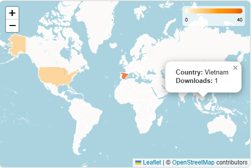

## Plugin Geolocalización de descargas para OMP/OJS

Este plugin proporciona un mapa mundial interactivo que visualiza las descargas de monografías (en OMP) y publicaciones/artículos (en OJS), desglosadas por país. Ofrece una representación visual del alcance global de tu contenido, permitiendo identificar las regiones con mayor interés en tus publicaciones. Utiliza la librería LeafletJS para la visualización del mapa.

**Imagen del plugin:**



**Características:**

- Mapa mundial interactivo con marcadores que representan las descargas por país.
- Intensidad de color proporcional al número de descargas (más descargas = marcador más intenso).
- Tooltips al pasar el cursor sobre los marcadores que muestran el número total de descargas para cada país.
- Compatible con OMP y OJS 3.4.
- Fácil instalación y configuración.
- Utiliza LeafletJS para una experiencia de mapa fluida e interactiva.

**Instalación:**

1. Copia el contenido del directorio del plugin a la carpeta `plugins` de tu instalación OMP/OJS.
2. Activa el plugin a través de la interfaz de administración.
3. **Integración en la plantilla:** Copia el siguiente código en la plantilla apropiada:

```html
<section id="downloads-world-map">
  <h3 class="label">
    {translate key="plugins.generic.downloadsWorldMap.displayName"}
  </h3>
  <div class="value">{$downloadsWorldMapHtml nofilter}</div>
</section>
```

**Uso:**

Una vez instalado, activado y con el código integrado en la plantilla, el plugin mostrará el mapa mundial en la sección de estadísticas de uso de cada monografía/publicación.

**Requisitos:**

- OMP/OJS 3.4
  .

**Licencia:**

[GNU General Public License v3.0](LICENSE)
